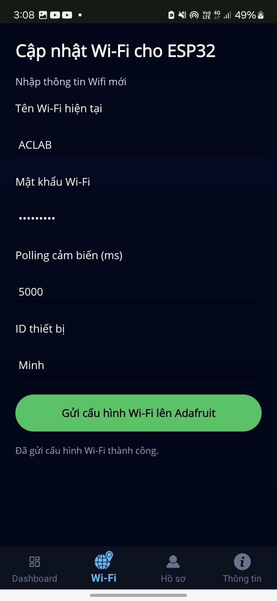
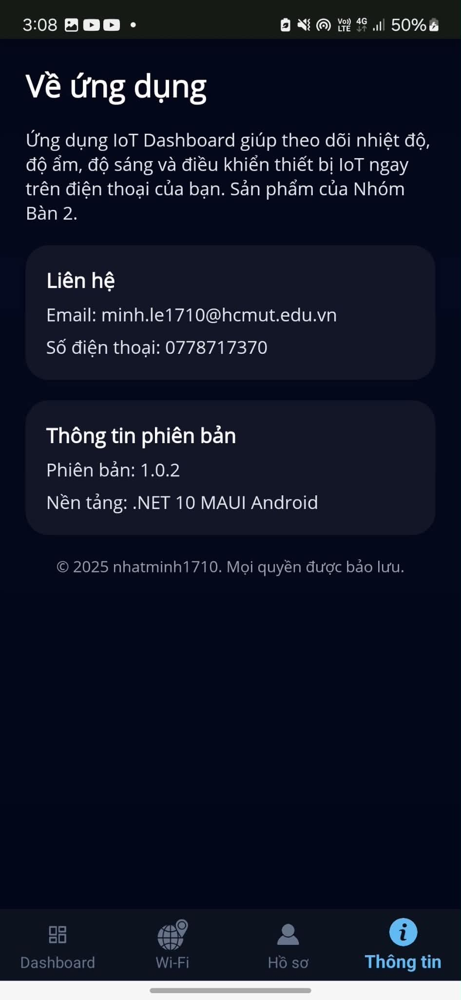
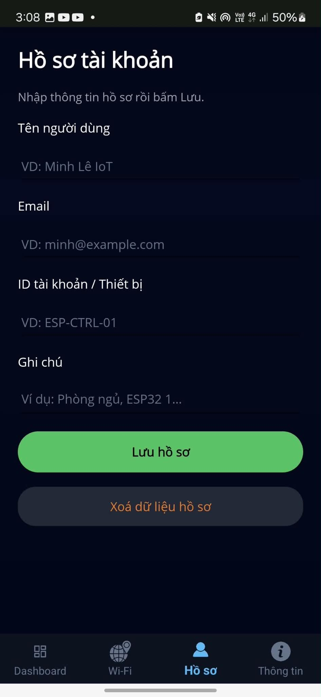

# CO3053 Android Dashboard App

Đây là project dashboard IoT mình làm bằng **.NET MAUI C#** cho môn CO3053. Hiện tại repo này là phần **khung giao diện/mobile app**, dùng để demo luồng xem dữ liệu môi trường như nhiệt độ, độ ẩm, ánh sáng, đồng thời có thêm bản đồ vị trí hiện tại và 2 công tắc điều khiển. Hướng phát triển tiếp theo là nối app này về **backend .NET** để backend đứng giữa xử lý API, lưu dữ liệu và giao tiếp với các service IoT.

Trang demo GitHub Pages:  
https://minh-le1710.github.io/CO3053-Android-Dashboard-App/

## Demo giao diện

| Trang chủ | Wifi |
| --- | --- |
|  |  |

| Thông tin | Profile |
| --- | --- |
|  |  |

## App làm được gì?

- Hiển thị dashboard theo phong cách mobile, nền tối và các widget gọn gàng.
- Có khung đọc dữ liệu sensor gồm nhiệt độ, độ ẩm và độ sáng.
- Cập nhật dữ liệu tự động mỗi 1 giây để nhìn thay đổi gần realtime.
- Theo dõi min/max của nhiệt độ và độ ẩm trong phiên mở app.
- Lấy thời tiết hiện tại của **Ho Chi Minh City** từ OpenWeatherMap.
- Hiển thị map và ghim vị trí hiện tại của người dùng.
- Có 2 nút công tắc để demo luồng điều khiển thiết bị.
- Dự kiến nối về **backend .NET** để gom logic xử lý dữ liệu, xác thực API key và làm cầu nối với Adafruit IO/thiết bị.

## Công nghệ sử dụng

- **.NET MAUI / C#**
- **XAML** để xây UI
- **Microsoft.Maui.Controls.Maps** cho bản đồ
- **.NET Backend** cho phần API trung gian ở bước phát triển tiếp theo
- **Adafruit IO API** để đọc và ghi dữ liệu IoT
- **OpenWeatherMap API** để lấy thời tiết

## Cấu trúc code

```text
.
|-- MainPage.xaml          # Giao diện dashboard chính
|-- MainPage.xaml.cs       # Xử lý logic, timer, map, button, cập nhật data
|-- Services/
|   |-- AdafruitService.cs # Kết nối Adafruit IO
|   `-- WeatherService.cs  # Lấy thời tiết từ OpenWeatherMap
|-- Models/
|   |-- AdafruitFeed.cs    # Model dữ liệu sensor
|   `-- WeatherModels.cs   # Model response thời tiết
|-- Resources/             # Ảnh, font, app icon, splash
`-- docs/
    `-- index.html         # Trang demo cho GitHub Pages
```

## Cách chạy project

1. Clone repo:

```bash
git clone https://github.com/minh-le1710/CO3053-Android-Dashboard-App.git
cd CO3053-Android-Dashboard-App
```

2. Mở project bằng Visual Studio có cài workload **.NET MAUI**.

3. Chọn target Android Emulator hoặc Windows, sau đó bấm Run.

4. Nếu chạy trên Android, cấp quyền location để app hiển thị được vị trí hiện tại trên map.

## Ghi chú nhỏ

Project này ưu tiên demo ý tưởng dashboard IoT cho môn học, nên hiện tại app vẫn còn mang tính khung và có phần gọi service trực tiếp để tiện test. Bước hợp lý tiếp theo là đưa API key và logic xử lý sang backend .NET, để mobile app chỉ gọi API của backend. Như vậy code sẽ gọn hơn, an toàn hơn và dễ mở rộng nếu sau này có thêm database, đăng nhập hoặc nhiều thiết bị.
